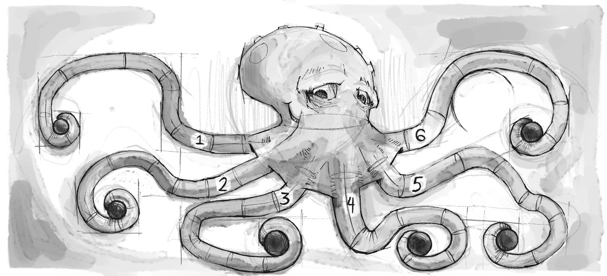

#数据结构：对象与数组

>“曾经有两次我被问到以下这个问题：‘尊敬的巴贝奇先生，如果将错误的数据输入机器，能否能够得到正确答案呢？’[...]我并不能很好的理解为什么有的人会有如此混淆的想法，以至于产生这样的疑问。”
>---查尔斯.巴贝奇，发表于《哲学家的生活》（1864）

数字、布尔值以及字符串就好比是数据结构构成的一块块砖。但是只用一块砖并不能造出多大的房子。对象可以将多个值分组化--包括其他对象--从而构造更多复杂的结构。

到目前为止，我们所编写的程序都被严重的束缚着--它们都仅仅使用简单的数据类型。本章将跟你一起来学习数据结构的基本用法。相信学习完本章，你将能够写出一些更加有用的程序。

本章将通过一些编程实例，介绍一些可以解决身边实际问题的概念。实例代码会涉及到函数以及变量，这些内容在之前的章节中已有介绍。

##松鼠人

雅克发现，一般在晚上八点到十点之间，他常会变成一个小小的，毛茸茸的，有着大大的尾巴的啮齿类动物。

一方面，雅克很庆幸自己不是传说中的变身为狼人。而是变成一个松鼠，这带来的麻烦似乎比变成一只狼要小得多。变成松鼠的他不用担心会发生意外吃掉自己的邻居（那实在太可怕了），只不过需要担心自己会被邻居家的猫给吃掉。早上醒来的时候，他会发现自己在一颗橡树顶部非常危险细弱的树枝上，并且浑身赤裸，找不着方向。在发生了两次这样的情况之后，晚上的时候他不得不锁紧房间的门窗，并且放一些松果在地板上，从而使变成松鼠的自己能够忙起来，而不至于跑出家去。

这样做能够使他自己免受猫和橡树问题的烦扰。但是雅克仍受这一情况的困扰。变身发生的不规律性使得他怀疑变身是因为某些事情所触发的。一开始，他深信如果某天他曾经碰到树，就会变成松鼠。于是他绝不触碰树木甚至避免靠近树木。但是这一问题依然存在。

为了找到变成松鼠的原因，雅克转而采用了一个更科学的方法，他打算开始把每天所做的事情记录下来并记录当天是否变身。通过记录下来的数据，他希望能够缩小触发变身的条件的范围。

他首先做的事情就是设计一个数据结构去存储这一信息。

##数据集合

为了处理一大堆数据，我们首先必须得找到一种在计算机内存中描述数据的方法。比如，举个简单的例子，我们想要描述一个数值集合：2,3,5,7,11。

我们可以使用特定的字符串——毕竟，字符串可以是任意长度，所以我们可以向字符串中存入很多数据——如使用字符串`"2 3 5 7 11"`来描述。但是这样做是很糟糕的。你将必须以某种特定的方法获取数值，将它们重新转换回数值，才能进行存取。

值得庆幸的是，`Javascript`提供了一种数据类型用来专门存储有序的值。这种数据类型叫做`数组(Array)`，它的写法是在一对方括号中将一系列的值用逗号隔开。

	var listOfNumbers = [2, 3, 5, 7, 11];
	console.log(listOfNumbers[1]);
	// → 3
	console.log(listOfNumbers[1 - 1]);
	// → 2

获取数组中的元素依然使用方括号标记法。方括号直接接在表达式后面，方括号中是另一个表达式。这种写法能够读取左侧表达式中，与方括号内表达式指向的索引对应的元素。

数组中的第一个索引为0，不是1。所以第一个元素可以使用一下方法读取：`listOfNumbers[0]`。如果你并没有编程背景，这一约定可能需要一些时间来适应一下。从0开始计数在技术领域有着很长一段时间的历史，只要`JavaScript`中的这一约定满足从0计数，就是有效的。

##属性

在之前的例子中，我们有见到一些奇怪陌生的表达式，比如`myString.length`(获取一个字符串的长度)和`Math.max`(求最大值函数)。这些表达式是用来读取某些值的一个属性值（`property`)。第一种情况是读取`myString`中的`length`属性的值。第二种情况是获取`Math`(`Math`对象中包含一些数学相关的值和函数)对象中名为`max`的属性。

几乎所有`Javascript`中的值都有属性，除了`null`和`undifined`之外。如果试图访问它们中的一个的属性，将会报错。

	null.length;
	// → TypeError: Cannot read property 'length' of null

在`Javascript`中有两种常用的方法来访问属性，使用点(`.`)或方括号(`[]`)。`value.x`和`value[x]`都可以访问`value`的一个属性。但是并不定是同一个属性。不同之处在于`x`作何解释。当使用点访问属性时，紧跟在点后面的部分必须是一个合法的变量名，它直接表示属性的名字。当使用方括号访问属性时，方括号中的表达式的计算值等于属性的名字。鉴于此，`value.x`获取的是`value`中名为“x”的属性值，`value[x]`先计算表达式x的值，再将计算结果作为属性名。

所以你知道你想要获取的属性名叫做“`length`”，你可以使用`value.length`。如果你想要获取名字存储在变量`i`中的属性的值，你可以使用`value[i]`。另外，由于属性名可以为任意字符串，如果你想访问名为“`2`”或“`John Doe`”的属性，你必须使用方括号：`value[2]`或`value["John Doe"]`。这种情况即使事先知道精确的属性名，也依然要使用方括号来访问。因为不管“`2`”还是“`John Doe`”都不是一个合法的变量名，因此不可以使用点标记来访问。

数组中的元素都是被存储在属性中的。因为这些属性的名字都是数字并且我们经常需要通过变量来获取这些属性名，所以我们必须使用方括号来访问数组中的元素。数组的`length`属性表明一个数组中包含多少元素。这一属性名是合法变量名，我们也事先知道，所以我们经常使用`array.length`来获取一个数组的长度，并且这也比`array["length"}`更容易书写。

##方法

字符串(`string`)和数组(`array`)除了`length`属性之外，都还有一系列值为函数的属性。

	var doh = "Doh";
	console.log(typeof doh.toUpperCase);
	// → function
	console.log(doh.toUpperCase());
	// → DOH

每个字符串都有一个`toUpperCase`属性。当调用这一属性时，将返回原本字符串的一个拷贝，返回的字符串中将原字符串中的所有字母都转化为大写字母。同样的字符串中还有一个`toLowerCase`属性。从字面意思应该就能看出它的作用。

有趣的是，即使调用`toUpperCase`方法时不传入任何参数，函数总能获取到字符串`Doh`，这个值就是我们调用的属性所属的值。至于这一情况到底怎么回事，我们将在[第六章](/chapter6.md)进行描述。

当属性的值为函数时，我们通常称这些属性为所属值的`方法`(method)。如之前所说，“`toUpperCase`是字符串的一个方法”。

下面的例子展示了数组对象包含的一些方法：

	var mack = [];
	mack.push("Mack");
	mack.push("the", "Knife");
	console.log(mack);
	// → ["Mack", "the", "Knife"]
	console.log(mack.join(" "));
	// → Mack the Knife
	console.log(mack.pop());
	// → Knife
	console.log(mack);
	// → ["Mack", "the"]

`push`方法能够用来向数组的末尾添加值（可以是一个或者多个）。`pop`方法的功能恰好相反：它会移除数组末尾的一个值并且返回这个值。一个字符串数组能够通过`join`方法扁平化为一个单独的字符串。`join`中传入的参数用来将数组中的各元素连接起来。

##对象

回到之前提到的松鼠人。每天的日志记录可以用一个数组来描述。但是每条记录并不只是包含数字或字符串——每条记录需要存储一系列的活动以及一个表示雅克是否变为松鼠的布尔值。理想的情况是，我们能够将这些值统一成一个单独的值，然后再将这些统一好的值放入日志记录数组中。

对象类型(`object`)的值是专门的属性的集合。我们可以随意添加或删除这些属性。一种创建对象的方法是使用大括号标记法。

	var day1 = {
	  squirrel: false,
	  events: ["work", "touched tree", "pizza", "running",
	           "television"]
	};
	console.log(day1.squirrel);
	// → false
	console.log(day1.wolf);
	// → undefined
	day1.wolf = false;
	console.log(day1.wolf);
	// → false

在大括号中，包含着一系列属性值，各属性值之间有分好(`;`)隔开。每一个属性都名字后面紧跟一个分号(`:`)，再后面接着一个表达式，这个表达式的值就是相应属性的值。空格和换行符是无效的。对象跨多行，如上例一样缩进排列能够提高代码的可读性。如果属性的名字不是一个合法的变量名或者是合法的数字则必须使用引号。

	var descriptions = {
	  work: "Went to work",
	  "touched tree": "Touched a tree"
	};

这就意味着大括号在`Javascript`中有*两种含义*。当大括号出现在语句的首部时，用来声明一个代码块。当大括号出现在其他位置时，则用来描述一个对象。幸运的是，在一条语句开始使用大括号定义对象几乎没有用处，在典型的程序中，这两种用法并没有什么矛盾之处。

读取一个并不存在的属性将得到`undefined`。在之前的例子中，读取`wolf`这个属性时就是这种情况。

可以使用赋值(`=`)操作符给一个属性表达式赋值。如果该属性已存在，则将新的值替换属性原本的值。如果该属性不存在，则在该对象上创建一个新属性，并将值赋予该新属性。

简单起见，参照变量绑定的触角模型——属性绑定也是类似的。这些触手抓着一些值，但是其他变量以及属性可能也持有这些相同的值。你可以把对象想象为章鱼，这些章鱼有着任意条的触手，每一个触手上面都标着一个名字。

`delete`操作符能够从这样一只章鱼身上砍掉一条触手。`delete`操作符是一元操作符。`delete`后面紧跟属性访问表达式，将移除该对象指定的属性。该操作符功能如上，不过却并不常用。

	var anObject = {left: 1, right: 2};
	console.log(anObject.left);
	// → 1
	delete anObject.left;
	console.log(anObject.left);
	// → undefined
	console.log("left" in anObject);
	// → false
	console.log("right" in anObject);
	// → true

`in`操作符为二元操作符，左侧为属性名(字符串)，右侧为对象。使用`in`操作符会返回一个布尔值，这个布尔值表明该对象中是否存在该属性。将一个对象的属性值设为`undefined`与使用`delete`操作符删除该属性是存在区别的。在第一种情况下，该对象中仍然存在该属性(只不过该属性没有有意义的值)，而第二种情况，该属性将不再存在于对象之中，使用	`in`操作符将得到`false`。

数组仅仅是一种特殊的对象，用来存储有序值。`typeof [1, 2]`的返回值即为`"object"`。可以将数组看成一个长长的扁平的章鱼，章鱼的触手上标着数字，并整齐地排列在一行。

那么接下来，我们可以将雅克的日记看成一个有对象组成的数组。

	var journal = [
	  {events: ["work", "touched tree", "pizza",
	            "running", "television"],
	   squirrel: false},
	  {events: ["work", "ice cream", "cauliflower",
	            "lasagna", "touched tree", "brushed teeth"],
	   squirrel: false},
	  {events: ["weekend", "cycling", "break",
	            "peanuts", "beer"],
	   squirrel: true},
	  /* and so on... */
	];

##易变性

接下来我们将学到一个实际编程的真理。不过首先我们还有最后一条理论需要理解。

之前我们有学习到，对象的值可以被改变。值的类型在之前的章节中已经讨论过，如数值(`number`)、字符串(`string`)以及布尔值(`boolean`)。这些类型的值都是*不可变的*——想要改变一个这些类型已存在的值是不可能的。可以结合它们，或者从中衍生出其他值。但是当你使用一个明确的字符串值时，这个值将一直保持不变。字符串中包含的文本是不可变的。如果你有一个内容为`"cat"`的字符串，你不可能使用其他代码来改变该字符串中的一个字符来使得字符串的内容为`"rat"`。

在另一方面，对象可以通过改变自身属性的值，来改变对象值的内容。

当我们有两个数值，120和120，我们可以认为他们是完全相同的数值。不管他们是否指向相同的物理内存。但是对于对象而言，两个指向相同的对象和两个包含相同属性的不同对象是不同的。思考一下如下代码：

	var object1 = {value: 10};
	var object2 = object1;
	var object3 = {value: 10};

	console.log(object1 == object2);
	// → true
	console.log(object1 == object3);
	// → false

	object1.value = 15;
	console.log(object2.value);
	// → 15
	console.log(object3.value);
	// → 10

变量`object1`和变量`object2`指向相同的对象，所以改变`object1`的值，`object2`的值也会发生改变。比较不同的对象将返回`false`，即使它们有着相同的内容。`Javascript`中没有内置深度比较的操作(深度比较对象的内容)，不过可以自己实现(本章之后的一个练习也会实现相关的功能)。

##兽化人的日志

于是，雅克开始启动他的`Javascript`解释器，搭建保存日志所需的环境。

	var journal = [];

	function addEntry(events, didITurnIntoASquirrel) {
	  journal.push({
	    events: events,
	    squirrel: didITurnIntoASquirrel
	  });
	}

于是，每天晚上十点甚至有时是第二天早上，当雅克从他自己的书架顶部后——他便开始记录一天的事情。

	addEntry(["work", "touched tree", "pizza", "running",
	          "television"], false);
	addEntry(["work", "ice cream", "cauliflower", "lasagna",
	          "touched tree", "brushed teeth"], false);
	addEntry(["weekend", "cycling", "break", "peanuts",
	          "beer"], true);

一旦雅克收集到足够的数据记录，他就可以尝试推断他变成松鼠和每天发生的事件之前的关联，从而能够从这些关联之中了解到一些有用的东西。

*关联*是变量之间依赖性的度量(这里所说的“变量”是从统计学角度的来说的概念，而不是`Javascript`的概念)。这一关联通常为值为[-1,1]的系数。系数为0时，表明变量之间没有关联；系数为1时，表明两变量之间完全相关；相应地系数为-1时，则容易想到。系数为-1时，同样意味着两个变量完全相关，只不过是负相关——当其中一个人为真时，另一个则为假。

对于二元变量，希腊字母(*ϕ*)可以用来很好的表示关联度量，相应地很容易计算。为了计算*ϕ*，我们需要一个表*n*,这个表中包含我们所比较的两个变量之间不同关联的次数。我们可以以吃披萨这件事为例，将之写入表格如下：

*ϕ*可以使用以下公式计算，*n*可以友表格得知：

 标记*n01*是指第一个变量(变为松鼠)为假(0)，第二个变量(pizza)为真(1)这种情况的次数。在本例中，*n01*为9。

 值*n1.*是指第一个变量为真这种情况的总次数，在上例的表格中共为5。同样地，*n.0*是指第二个变量为假这种情况的总次数。

 所以，参照披萨事件表格，分号上面的部分为`1*76 - 4*9 = 40`，分号下面的部分为5*85*10*80的平方根，即为340000的平方根。可以计算得出，*ϕ ≈ 0.069*，这个相关系数是很小的。所以吃披萨可以认为对转变并无影响。

 ##相关性计算

在`Javascript`中，我们可以使用一个四个元素的数组([76, 9, 4, 1])来描述一个2行2列的表格。当然也可以使用其他描述方式，比如一个包含两个数组元素的数组或者一个包含如`11`和`01`属性名的对象。不过一维数组比较简单，并且可以很方便的访问上述表达式中的各变量。可以将上述表达式中的各变量看作一个两位的二进制数，左边一位表示松鼠变量，右边一位表示相应的事件变量。比如，二进制数`10`是指雅克变成松鼠，但是没有吃披萨这一情况。这一情况发生了四次。二进制数`10`转化为十进制为`2`，则将这个次数存入数组中，索引为2。

下面是一个函数，该函数可以从上述这样一个数组中计算出相关性*ϕ*：

	function phi(table) {
	  return (table[3] * table[0] - table[2] * table[1]) /
	    Math.sqrt((table[2] + table[3]) *
	              (table[0] + table[1]) *
	              (table[1] + table[3]) *
	              (table[0] + table[2]));
	}

	console.log(phi([76, 9, 4, 1]));
	// → 0.068599434

该例子将计算*ϕ*的公式简单直接的转化为`Javascript`中的函数。`Math.sqrt`是`Javascript`标准环境中的`Math`对象提供的求平方根的函数。因为我们的数据结构中并没有直接存储求和的行与列，所以必须对表格中的两个区域求和来求取*n1.*。

雅克保持记录日记三个月左右。这个结果数据集合在下载文件中的[本章代码](code/jacques_journal.js)内的可以找到，保存在`JOURNAL`变量中。

从这份日记文件中提取出某个特定事件2行2列的表格，必须循环读取所有记录，计算出与变身松鼠有关的事件发生了多少次。

	function hasEvent(event, entry) {
	  return entry.events.indexOf(event) != -1;
	}

	function tableFor(event, journal) {
	  var table = [0, 0, 0, 0];
	  for (var i = 0; i < journal.length; i++) {
	    var entry = journal[i], index = 0;
	    if (hasEvent(event, entry)) index += 1;
	    if (entry.squirrel) index += 2;
	    table[index] += 1;
	  }
	  return table;
	}

	console.log(tableFor("pizza", JOURNAL));
	// → [76, 9, 4, 1]

`hasEvenet`函数测试一条记录中是否包含给定的事件。数组的`indexOf`方法将判断一个给定值(在当前情况下，这个给定值为事件名)是否存在于数组中。所以如果`indexOf`返回的不为`-1`，则该事件存在于该条记录中。

`tableFor`函数中的循环体通过判断指定的事件是否存在以及是否有变成松鼠来计算关系表格中的哪个数值需要变化。循环中将相应数组中需要变化的数值加1。

现在我们有计算独立相关性的工具了。还有一件要做的事情是找到被记录的事件之间的相关性。看看是否有任何事件比较特别。但是我们是否一计算出这些相关性就存储起来？

##对象映射

一个可行的方法是将每个事件的对象的名和值存在对象中，再将所有这些对象放入一个数组。但是这样处理会使得查找一个给定事件的相关性或多或少有些麻烦：你必须便利整个数组，从而找出包含指定事件名的对象。当然，我们可以将这一查找过程写入函数，但是这么做仍然会需要书写更多的代码，计算机也将会比实际需要做出更多的计算。

一个更好的方法是将各相关性存入对象，相应属性的名称为对象的事件类型。这样我们就可以使用方括号来创建和读取属性值，并且可以使用`in`操作符来检测给定的属性是否存在。

	var map = {};
	function storePhi(event, phi) {
	  map[event] = phi;
	}

	storePhi("pizza", 0.069);
	storePhi("touched tree", -0.081);
	console.log("pizza" in map);
	// → true
	console.log(map["touched tree"]);
	// → -0.081

映射是将一个变化域内的值指(本例中为事件名)向另一变化域内相应的值(本例中为相关性*ϕ*)的方法。

像现在这样使用对象仍然有一些潜在问题，这些问题我们将在[第六章](/chapter6.md)中讨论，暂时不用担心这些问题。

倘若我们需要读取已存储的所有事件的相关性该如何操作？对象中的这些属性不像是数组，没有特定的顺序。所以我们就不能够使用简单的`for`循环来实现这一操作。`Javascript`中提供了专门用来遍历对象属性的循环结构。这一循环结构与普通的`for`相似，不过与普通`for`循环的区别是`in`。

	for (var event in map)
	  console.log("The correlation for '" + event +
	              "' is " + map[event]);
	// → The correlation for 'pizza' is 0.069
	// → The correlation for 'touched tree' is -0.081

##最后的分析

为了找到数据集合中的所有事件类型，我们只需简单地依次处理各条记录然后遍历每条记录中的事件。创建一个对象`phis`，将至今的所有事件类型的相关性系数存储其中。只要某种事件类型不在`phis`中，则计算该事件的相关性并将其存入`phis`中。

	function gatherCorrelations(journal) {
	  var phis = {};
	  for (var entry = 0; entry < journal.length; entry++) {
	    var events = journal[entry].events;
	    for (var i = 0; i < events.length; i++) {
	      var event = events[i];
	      if (!(event in phis))
	        phis[event] = phi(tableFor(event, journal));
	    }
	  }
	  return phis;
	}

	var correlations = gatherCorrelations(JOURNAL);
	console.log(correlations.pizza);
	// → 0.068599434

然们一起看看结果如何。

	for (var event in correlations)
	  console.log(event + ": " + correlations[event]);
	// → carrot:   0.0140970969
	// → exercise: 0.0685994341
	// → weekend:  0.1371988681
	// → bread:   -0.0757554019
	// → pudding: -0.0648203724
	// and so on...

最多的相关性都集中在0附近。吃胡萝卜，面包或布丁很明显不会触发松鼠变身。尽管这些事情在周末都经常发生。所以我们过滤一下结果，只留下相关性大于0.1或者小于-0.1的事件。

	for (var event in correlations) {
	  var correlation = correlations[event];
	  if (correlation > 0.1 || correlation < -0.1)
	    console.log(event + ": " + correlation);
	}
	// → weekend:        0.1371988681
	// → brushed teeth: -0.3805211953
	// → candy:          0.1296407447
	// → work:          -0.1371988681
	// → spaghetti:      0.2425356250
	// → reading:        0.1106828054
	// → peanuts:        0.5902679812

看！有两个事件的相关性明显比其他的事件的相关性要高很多。吃坚果与变身松鼠有着很大的正相关性，刷牙则有着很大的负相关性。

有趣吧。我们来尝试一些事情。

	for (var i = 0; i < JOURNAL.length; i++) {
	  var entry = JOURNAL[i];
	  if (hasEvent("peanuts", entry) &&
	     !hasEvent("brushed teeth", entry))
	    entry.events.push("peanut teeth");
	}
	console.log(phi(tableFor("peanut teeth", JOURNAL)));
	// → 1

好了，这就对了。如果雅克吃了坚果却没有刷牙，则他会变身成松鼠。如果他不是这样一个不爱护牙齿卫生的懒汉的话，他也就不会受到变身的烦恼了。

知道了这个之后，雅克只要完全不吃坚果，就能够完全摆脱变身的困扰了。

雅克已经好了好长一段时间。不过在几年之后，他丢掉了自己的工作，最终不得不在马戏团就职，他的工作就是每次表演之前在嘴巴中填满坚果，完成变身，表演*不可置信的松鼠人*。一天，因为嘴巴中有太多坚果这里漏洞存在，雅克没能变回为人类，从马戏团帐篷中的缝隙中跳走，消失在了森林之中，之后就再也没有出现过。

##深度学习数组

在本章结束之前，我们要再多介绍一些相关概念。首先我们先介绍一些常用的数组方法。

[本章之前](chapter4.md#array_methods)我们学习了`push`和`pop`，用来添加和删除数组尾部的元素。相对应的在数组首部添加和删除元素的方法为`unshift`和`shift`。

	var todoList = [];
	function rememberTo(task) {
	  todoList.push(task);
	}
	function whatIsNext() {
	  return todoList.shift();
	}
	function urgentlyRememberTo(task) {
	  todoList.unshift(task);
	}

上面的代码能够管理任务列表。你可以调用`rememberTo("eat")`在列表的最后添加任务.如果需要一些其他操作，可以使用`whatIsNext()`来获取(删除)列表最前面的项。`urgentlyRememberTo`可以在列表的首部添加任务而不是列表的尾部。

`indexOf`还有一个兄弟方法`lastIndexOf`。`lastIndexOf`从数组的尾部查找给定元素，而`indexOf`是从头开始。

	console.log([1, 2, 3, 2, 1].indexOf(2));
	// → 1
	console.log([1, 2, 3, 2, 1].lastIndexOf(2));
	// → 3

`indexOf`和`lastIndexOf`都有第二个可选参数，该参数指定开始查找的位置。

另一个基本方法是`slice`。该方法传递一个开始索引和结束索引，然后返回一个数组，该数组中原数组的片段(从开始索引到结束索引)。包括开始索引对应的元素(第一个参数)，但是不包括结束索引对应的元素(第二个参数)。

	console.log([0, 1, 2, 3, 4].slice(2, 4));
	// → [2, 3]
	console.log([0, 1, 2, 3, 4].slice(2));
	// → [2, 3, 4]

当结束索引没有指定时，`slice`将返回从开始索引开始的所有元素。字符串也有`slice`方法，与数组的`slice`方法功能相似。

`concat`方法可以用来合并数组，就想使用`+`操作符来拼接字符串。接下来的例子中可以看到`concat`和`splice`的实际应用。该例子传入一个数组和索引，返回一个新数组，新数组为原数组的一个拷贝，并且将指定索引的元素删除。

	function remove(array, index) {
	  return array.slice(0, index)
	    .concat(array.slice(index + 1));
	}
	console.log(remove(["a", "b", "c", "d", "e"], 2));
	// → ["a", "b", "d", "e"]

##字符串及其各属性

我们之前已经学习过字符串的`length`和`toUpperCase`属性。如果想要添加一个新属性，却并不一定生效。

	var myString = "Fido";
	myString.myProperty = "value";
	console.log(myString.myProperty);
	// → undefined

字符串、数值和布尔型的值不是对象。如果试图给这些值添加新属性，尽管语言本身并不会有什么不满，但是这些属性并没有被实际存储。这些值是不不可变的。

不过这些类型的值有些内置属性。字符串值有一系列的方法。最有用的方法可能就是`slice`和`indexOf`，这两个方法与数组中的方法同名。

	console.log("coconuts".slice(4, 7));
	// → nut
	console.log("coconut".indexOf("u"));
	// → 5

字符串的`indexOf`方法和数组的`indexOf`方法有一定的区别。字符串的`indexOf`方法可以查找一个大于两个字符的字符串，而数组的`indexOf`方法只能查找一个单独的元素。

	console.log("one two three".indexOf("ee"));
	// → 11

`trim`方法可以移除字符串首尾的空白符(空格，换行符，制表符等)。

	console.log("  okay \n ".trim());
	// → okay

已经知道字符串类型的值有`length`属性。可以使用`charAt`方法读取字符串中的一个单独的字符，也可以像数组一样，简单地使用数字索引来读取。

	var string = "abc";
	console.log(string.length);
	// → 3
	console.log(string.charAt(0));
	// → a
	console.log(string[1]);
	// → b

##参数对象`arguments`

当一个函数被调用时，运行的函数体内有一个特别的变量`arguments`。这个变量指向一个对象。该对象包含存入函数的所有参数。在`Javascript`中可以传递比声明时的参数更多的参数。

	function noArguments() {}
	noArguments(1, 2, 3); // This is okay
	function threeArguments(a, b, c) {}
	threeArguments(); // And so is this

`arguments`对象中的`length`代表传入函数的参数个数。每个参数都对应着对象中的一个属性，如0，1,2。

如果你觉得这听起来像是数组，那就对了，它是一个类数组。不过不幸地是，该对象并没有响应数组的方法(比如`slice`或`indexOf`)，所以很难当作一个真实数组来用。

	function argumentCounter() {
	  console.log("You gave me", arguments.length, "arguments.");
	}
	argumentCounter("Straw man", "Tautology", "Ad hominem");
	// → You gave me 3 arguments.

有些函数可以传入任意个参数，比如`console.log`。这些函数就是典型的遍历内部`arguments`对象的值。`arguments`对象可以用来创建一些很有用的接口。例如，还记得我们如何创建雅克日志中的各条记录吧。

	addEntry(["work", "touched tree", "pizza", "running",
	          "television"], false);

一旦需要经常调用该参数，我们可以创建一个更加易用的函数。

	function addEntry(squirrel) {
	  var entry = {events: [], squirrel: squirrel};
	  for (var i = 1; i < arguments.length; i++)
	    entry.events.push(arguments[i]);
	  journal.push(entry);
	}
	addEntry(true, "work", "touched tree", "pizza",
	         "running", "television");

这种方法使用正常的方法来读取第一个参数(`squirrel`)，然后遍历地将`arguments`对象中其他参数(从索引1开始遍历，跳过第一个参数)都放入一个数组中。

##`Math`对象

正如我们所知，`Math`对象是数字相关的使用函数的集合。比如`Math.max`(求最大值)，`Math.min`(求最小值)，以及`Math.sqrt`(求平方根)。

`Math`对象只是简单的用做一个容器，来存储一堆相关功能。只有一个`Maht`对象，它几乎从不会用做一个单独的值。反而，它提供一个*命名空间*，用来定义一些不需要定义为全局的函数和值。

如果有太多的全局变量则会污染命名空间。越多的全局变量，则越可能发生冲突，导致意外地修改某些变量的值。比如，如果你想要在自己的某个程序中定义`max`就不是不可能。因为`Javascript`的内置`max`函数安全地定义在`Math`对象中，不需要担心会被重写。

在你定义一个变量，并且该变量名已经被使用，许多语言会阻止你，或者至少会给出警告。`Javascript`并没有这样做，所以你要当心。

说回`Math`对象。如果你需要计算三角函数，`Math`对象可以提供帮助。`Math`对象包含`cos`(余弦)，`sin`(正弦)，`tan`(正切)，以及它们各自的反函数，`acos`，`asin`，`atan`。

数值*π*(pi)可以通过`Math.PI`获取到——该值至少与`Javascript`中的提供的值极为接近。(这样命名常量值在所有计算机系统中是一个古老的传统)。

	function randomPointOnCircle(radius) {
	  var angle = Math.random() * 2 * Math.PI;
	  return {x: radius * Math.cos(angle),
	          y: radius * Math.sin(angle)};
	}
	console.log(randomPointOnCircle(2));
	// → {x: 0.3667, y: 1.966}

如果你不熟悉正弦和余弦，别担心。本书[第十三章](chapter13.md#sin_cos)会讲述如何使用。

上例中使用到了`Math.random`。调用这一函数将会返回[0,1)之间的伪随机数。

	console.log(Math.random());
	// → 0.36993729369714856
	console.log(Math.random());
	// → 0.727367032552138
	console.log(Math.random());
	// → 0.40180766698904335

尽管计算机是确定型机器——只要你给出正确的输入，计算机将执行相同的过程——但是计算机也是可以产生随机数的。为了做到这一点，计算机在内存中保存一个数值(或者一堆数字)。每当需要产生一个随机数时，它在内存中执行一些复杂的确定性计算，并且返回这些计算结果的部分值。计算机在用这个结果来改变它之前存有的内部值，从而下一个随机数的产生将会变得不同。

如果我们想要得到一个真正的随机数而不是伪随机数，我们可以在`Math.random`的计算结果上使用`Math.floor`(该方法会将非整数直接取整，省略掉小数部分)。

	console.log(Math.floor(Math.random() * 10));
	// → 2

讲一个随机数乘以10，我们会得到一个大于等于0，小于10的数。因为`Math.floor`向下求整，该表达式将会等概率的得出0到9之间的任一数字。

`Math`对象还有函数`Math.ceil`("ceiling"的缩写，表示向上求整)和`Math.round`(就近求整)。

##本章小结

对象和数组(数组也是对象的一种特例)提供了将一组值整合为一个值的方法。单纯从概念上来理解，这样可以允许我们将一系列相关的事情放在一个袋子中，然后围绕这个袋子做处理，而不需要掌握每一个单独的事情。

`Javascript`中大部分的值存在属性，除了`null`和`undefined`之外。属性值可以通过`value.propName`或者`value["propName"]`来访问。对象倾向于使用定义属性，来存储一些列固定的可多可少的属性值。另一方面，数组通常包含不同的数字编号(从0开始)，并将其作为属性名。

数组中有一些已经命名好的属性，比如`length`和一系列的方法。方法即为函数，通常存储在属性的属性值中。

对象也可以看作是映射，将名字与值连接在一起。`in`操作符能够判断对象中是否给定名字的属性。也可以用在`for`循环(`for (var name in object)`)中遍历对象的所有属性.

##练习

###连续数字求和

本书的[引言](README.md)曾之初
